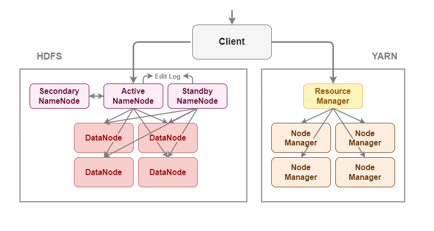

# Deploy Hadoop Guide
Guide for deploying Apache Hadoop in three vitrual machines.  



## Overview

- Virtual Machine: Ubuntu v22.04.4
- Platform: JDK 8
- System: Hadoop v3.3.6

### Architecture

**10.0.0.1 hadoop01**: NameNode DataNode  
**10.0.0.2 hadoop02**: SecondaryNameNode DataNode  
**10.0.0.3 hadoop03**: DataNode  
**10.0.0.4**: DNS(not necessary)   
mount at **/mnt/hadoop**  

## IP And Host

### Setting IP

```bash
sudo vim /etc/netplan/00-installer-config.yaml
```
refer to [00-installer-config.yaml](./00-installer-config.yaml)

### Setting Hostname And Hosts

```bash
sudo vim /etc/hostname
```
modify to hadoop01

```bash
sudo vim /etc/hosts

```
add below
```
10.0.0.1 hadoop01
10.0.0.2 hadoop02
10.0.0.3 hadoop03
```

reboot vm after setting
```bash
sudo reboot
```

## Hadoop Admin

```bash
sudo addgroup hadoop_group
sudo adduser --ingroup hadoop_group hadoop_admin
sudo usermod -aG sudo hadoop_admin
```

switch to hadoop_admin
```bash
su hadoop_admin
cd ~
```

## SSH Key
```bash
ssh-keygen -t rsa -P ""
cat ~/.ssh/id_rsa.pub > ~/.ssh/authorized_keys
```

## Install Java And Hadoop
```bash
sudo apt-get update
```

### Java
```bash
sudo apt-get install openjdk-8-jdk
```

### Install Hadoop
use /usr/local/hadoop as HADOOP_HOME

```bash
wget https://dlcdn.apache.org/hadoop/common/hadoop-3.3.6/hadoop-3.3.6.tar.gz
tar zxvf hadoop-3.3.6.tar.gz
sudo mv hadoop-3.3.6/ /usr/local/hadoop
```

### Environment
```bash
vim ~/.bashrc
```
add below
```
export HADOOP_HOME=/usr/local/hadoop

export JAVA_HOME=/usr/lib/jvm/java-8-openjdk-amd64
export HADOOP_INSTALL=$HADOOP_HOME
export HADOOP_MAPRED_HOME=$HADOOP_HOME
export HADOOP_COMMON_HOME=$HADOOP_HOME
export HADOOP_HDFS_HOME=$HADOOP_HOME
export YARN_HOME=$HADOOP_HOME
export HADOOP_COMMON_LIB_NATIVE_DIR=$HADOOP_HOME/lib/native
export HADOOP_OPTS="$HADOOP_OPTS -Djava.library.path=$HADOOP_HOME/lib/native"

export PATH=$PATH:$HADOOP_HOME/bin:$HADOOP_HOME/sbin
export HADOOP_CLASSPATH=$JAVA_HOME/lib/tools.jar
```

make environment variables effective
```bash
source ~/.bashrc
```

check variable
```bash
echo $HADOOP_HOME
```

## Setting HDFS Config

### CORE
```bash
vim /usr/local/hadoop/etc/hadoop/core-site.xml
```

refer to [core-site.xml](./core-site.xml)  

setting
- fs.defaultFS at hadoop01
- hadoop.tmp.dir at `/mnt/hadoop`, if error exists you can delete this dir and restart.  


### HDFS

```bash
vim /usr/local/hadoop/etc/hadoop/hdfs-site.xml
```

refer to [hdfs-site.xml](./hdfs-site.xml)

setting
- namenode at hadoop01
- namenode and datanode tmp.dir at `/mnt/hadoop`, if error exists you can delete this dir and restart.  
- secondary at hadoop02

### Works(DataNode)

```bash
sudo vim /usr/local/hadoop/etc/hadoop/workers
```

add below
```
hadoop01
hadoop02
hadoop03
```

### Environment

```bash
sudo vim /usr/local/hadoop/etc/hadoop/hadoop-env.sh
```

add below
```
export JAVA_HOME=/usr/lib/jvm/java-8-openjdk-amd64

export HDFS_NAMENODE_USER="hadoop_admin"
export HDFS_DATANODE_USER="hadoop_admin"
export HDFS_SECONDARYNAMENODE_USER="hadoop_admin"
export YARN_RESOURCEMANAGER_USER="hadoop_admin"
export YARN_NODEMANAGER_USER="hadoop_admin"
```

### Mount Disk
create file and change mode  
```bash
sudo mkdir -p /mnt/hadoop
sudo chmod -R 777 /mnt/hadoop
```

## Start

copy vm as three and modify ip and hostname, **no other settings need to be adjusted**.  

### Format NameNode(on hadoop01)
```bash
cd $HADOOP_HOME
bin/hdfs namenode -format
```

### Start All(on hadoop01)
```bash
sbin/start-all.sh
```

## Check Status

### JPS(on each vm)
```bash
jps
```

expect by architecture we set
```
2132 NameNode
2265 DataNode
7546 NodeManager
9295 Jps
```

### HDFS(on hadoop01)
```bash
hdfs dfsadmin -report
```

expect to see three datanodes
```
Configured Capacity: 12983532773376 (11.81 TB)
Present Capacity: 12323766214656 (11.21 TB)
DFS Remaining: 12323766124544 (11.21 TB)
DFS Used: 90112 (88 KB)
DFS Used%: 0.00%
Replicated Blocks:
        Under replicated blocks: 0
        Blocks with corrupt replicas: 0
        Missing blocks: 0
        Missing blocks (with replication factor 1): 0
        Low redundancy blocks with highest priority to recover: 0
        Pending deletion blocks: 0
Erasure Coded Block Groups:
        Low redundancy block groups: 0
        Block groups with corrupt internal blocks: 0
        Missing block groups: 0
        Low redundancy blocks with highest priority to recover: 0
        Pending deletion blocks: 0

-------------------------------------------------
Live datanodes (3):

Name: 10.0.0.1:9866 (hadoop01)
Hostname: hadoop01
Decommission Status : Normal
Configured Capacity: 4327844257792 (3.94 TB)
DFS Used: 339968 (332 KB)
Non DFS Used: 2154496 (2.05 MB)
DFS Remaining: 4107922767872 (3.74 TB)
DFS Used%: 0.00%
DFS Remaining%: 94.92%
Configured Cache Capacity: 0 (0 B)
Cache Used: 0 (0 B)
Cache Remaining: 0 (0 B)
Cache Used%: 100.00%
Cache Remaining%: 0.00%
Xceivers: 0
Last contact: Mon Jul 15 09:28:38 UTC 2024
Last Block Report: Mon Jul 15 07:58:02 UTC 2024
Num of Blocks: 34

...
```
